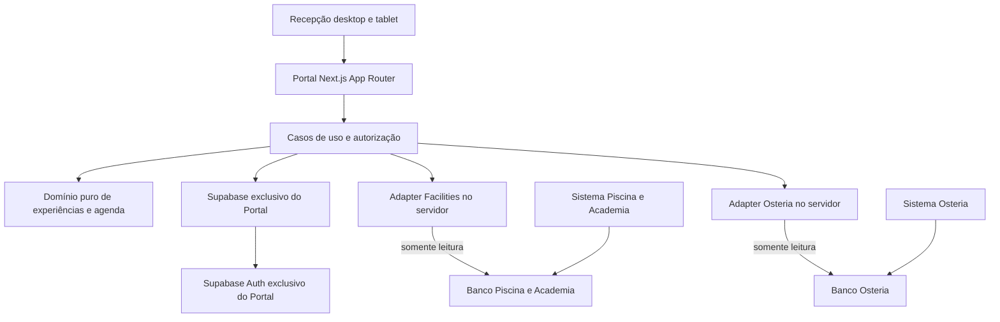

# Arquitetura

## Estado atual

Portal-Valle contém a fundação Next.js App Router, design system em `src/components/ui`, estrutura de navegação em `src/components/shell`, oito rotas e estados de preparação. `/` redireciona para `/hoje`. Layout e páginas são Server Components; navegação ativa, menu mobile e diálogos têm interações client. Fontes e logo são locais. Fase 3 adiciona migration mínima `portal_settings` com RLS/default deny, configuração de identidade e clientes Supabase browser/server de leitura, ainda não usados nas páginas. Banco de validação é efêmero em CI; Supabase hospedado adiado por quota conforme escolha do proprietário. Fase 4 implementa Auth individual e RBAC por perfil ativo/sessão viva, validados no CI 37090654113; hosted/equipe real permanecem desconectados. Login/logout, proxy SSR, guards em cada página e matriz can central estão em AUTH_AND_RBAC. Fase5 adiciona modelo experiences/occurrences/bookings/audit, domínio puro e mapper, validado no CI37151730319; Fases 6/8 acrescentam Cine e Pizza: Server Actions com guard e Zod, consultas e UI compartilhadas por configuração explícita, wrappers RPC separados por categoria/slug e helpers privados transacionais. Não há adapters externos operacionais. As arquiteturas externas estão em `../architecture/FACILITIES_AUDIT.md` e `../architecture/OSTERIA_AUDIT.md`. Código em main dos sistemas externos não prova qual commit está em produção.

## Arquitetura alvo



Nenhuma seta dos sistemas existentes para o Portal. Sem foreign keys entre projetos, autenticação compartilhada, hotlink de logo, importação de código externo ou sincronização permanente de hóspedes.

## Organização progressiva

Next.js App Router/React/TypeScript strict; componentes de servidor para carga inicial. Cliente somente para interação. Domínio não importa React, Next, Supabase, DOM ou browser APIs. Casos de uso pequenos recebem dependências explícitas onde agregação, testes ou substituição do provider justificarem um port.

Estrutura alvo, criada apenas à medida que cada fase usar os caminhos:

```text
src/
  app/                       # rotas, boundaries, actions
  components/                # UI comum do Portal
  modules/
    experiences/{domain,application,infrastructure,ui}/
    weekly-program/{domain,application,ui}/
    agenda/{domain,application,ui}/
    auth/{domain,application,infrastructure}/
  integrations/{facilities,osteria}/
  lib/                       # tempo do hotel, ENV, erros, logs
supabase/migrations/
supabase/seed.sql             # apenas dados fictícios de desenvolvimento
tests/{integration,e2e}/
public/brand/
docs/{ai,architecture}/
```

Stays: Fase 15 cancelada (ADR-018), não criar. `weekly-program/infrastructure` só se surgir persistência própria justificada; na primeira versão a semana consulta occurrences. Não criar diretórios vazios nesta fase.

## Dados e regras

Portal é fonte de verdade de experiências, occurrences, inscrições, usuários próprios, configurações e auditoria. Capacidade usa persons/bookings/units/unlimited; nunca renderizar um denominador sem unidade. Todas as entradas importantes passam por validação no servidor, autorização central e invariantes SQL.

Transações de reserva devem serializar a capacidade por occurrence, verificar novamente disponibilidade e autorização, aplicar idempotência e inserir auditoria na mesma transação. Edição de quantidade, mudança de occurrence, cancelamento/restauração e redução de capacidade precisam da mesma proteção. Chamadas diretas à tabela não podem contornar essas regras. Desenho SQL exato será validado nas Fases 3/5/6.

## Agenda e falhas

`GetDailyAgenda(LocalDate)` agrega providers independentes via `Promise.allSettled`, cada um com timeout finito e consulta limitada ao dia. Retorna entries ordenadas, status por fonte, fetchedAt e erro normalizado. IDs compostos `source:id` evitam colisões; unknown, unavailable e empty são estados distintos. Não inventar zero reservas quando uma integração falhar.

UI parcial continua utilizável. Não transmitir erros SQL/stack traces ao browser. Cada integração valida payload e traduz seu schema para DTO Portal. Nenhuma importação do boot/listeners Osteria: eles podem escrever mesmo durante ações aparentemente de leitura.

## Tempo e cache

Timezone do hotel: America/Sao_Paulo. `LocalDate` validada YYYY-MM-DD representa um dia do hotel; instantes usam UTC/timestamptz. Consultas de instante usam intervalo semiaberto [início do dia, início do próximo dia), convertido com timezone, inclusive quando servidor/navegador estiverem em outro fuso. Integrações que armazenam date + time recebem tradução explícita.

Agenda e ocupação: carga inicial `no-store` no servidor e refresh após mutações; sem cache compartilhado contendo PII. Catálogo estático pode receber revalidação explícita posteriormente. Realtime não será adicionado automaticamente; demonstrar benefício antes. Nenhuma biblioteca de estado global.

## Autenticação e segurança

Supabase Auth próprio. Política `can(user, permission)` central com matriz explícita e equivalente no banco. Perfil ativo/revogação verificados no servidor; nunca confiar em role recebido no formulário ou user_metadata editável. RLS habilitada e grants mínimos; sem acesso anônimo a dados internos. Chave pública com sessão do usuário é caminho normal, chave privilegiada não é requisito universal.

Integrações: servidor → acesso comprovadamente restrito → banco externo. As permissões hoje observadas não satisfazem isso automaticamente. Qualquer novo role/view/RPC no externo depende de autorização específica futura. Até lá, provider desativado e link ao sistema de origem.

Auditoria registra actor, entidade, ação, campos relevantes e horário; não snapshots irrestritos de PII. Logs estruturados com requestId, duração e errorCode. Segredos nunca com NEXT_PUBLIC_. Política de retenção/anonimização precisa de decisão do hotel antes de dados reais.

## Fase 9 — projeção e duplicação semanal

Domínio week.ts valida data civil/segunda e converte fronteiras no fuso do hotel, com relógio injetado para hoje. loadWeek consulta occurrences por [from,until), limitado a100 (101 detecta excesso, falha sem truncar silenciosamente), sem hóspedes. Programação usa Server Component protegido experiences.read, criação/edição/cancelamento nas mesmas rotas operacionais e revalidação após mutação.

portal_duplicate_week usa weekly_program.manage e begin_mutation; resultado uuid[] em tabela privada com RLS/grants fechados. Um advisory lock comum serializa todos os writers operacionais de occurrences e lotes antes de catálogo/rows, evitando destino vazio observado por duplicações concorrentes ou por criador manual. Bookings continuam seus locks de capacidade sem bloqueio global extra. Clone copia configuração/horários locais, detecta horário inexistente por roundtrip, novos IDs/version1/responsiblecurrent/statusdraft; não consulta/copia bookings. Receipt/auditoria/cópias transacionais.

Fase 10: modules/agenda separa DTO estrito, GetDailyAgenda, provider de experiências e timeline. allSettled/timeout/abort isolam consultas; IDs compostos e ordenação determinística. lib/hotel-date centraliza calendário e fronteiras civis America/Sao_Paulo, inclusive DST histórico; consultas [from,until) por início. Guard portal.read precede carga; SSR/RLS existente. Sem novo schema ou provider legado nesta fase. Ver DAILY_AGENDA_OPERATIONS.md.

Facilities: domínio valida slots civis/IDs e DTO sem PII; aplicação readFacilityDay isola deadline/abort e exige resposta completa. Factory server-only null fecha conexão; UI guard facilities.read, estado pendente sem zero e link original. Sem novo banco ou transporte externo. Ver FACILITIES_OPERATIONS.

Osteria: mapper puro valida projeção mínima/flags/join tipo, datas/segundos e IDs; application deadline/abort/complete=true/resumo ativo. Factory null sem transport/ENV. Página guard osteria.read, navegação e link original; sem SDK/JS legado importado. Conversor hotel-time estendido para segundos civis exatos e offsets históricos, preservando minutos. Ver OSTERIA_OPERATIONS.

Home: GetHotelDay concreto compõe aplicações existentes/allSettled; DTO mínimo e ordenação. Guard retornaStaff e página aplica can por fonte antes da carga. SemAuth/externalreadersnull mantém preparação. Cards distinguem desconhecido/falha/vazio; vazio global exige todas consultadasvazias. Ver HOME_TODAY_OPERATIONS.

2026-10-06 — Fase14: matriz resiliência9falhas (offline/timeout/schema x Portal/Facilities/Osteria), paralelo, recuperação e resposta tardia. ENV ausente/parcial/chave administrativa testados.132unit/check locais PASS; CI/revisão pendentes. Somente testes/docs, sem falhas induzidas em bancos reais, runtime inalterado.

2026-10-06 — Solicitação do proprietário: programação do log no início de Hoje. Informativo Bem-estar09–12/10/2026 confirmado (sexta a segunda), transcrição sem PII, dias expansíveis. Substitui welcome banner; não altera reservas/capacidades nem conecta log. Inserção manual em código; editor recorrente pendente. Check132/build PASS; validação final E2E/CI/revisão em andamento.

2026-10-06 — Fase15 conceitual: proprietário escolheu cadastro próprio com apartamento/entrada/saída e vínculos explícitos. Modelo/GetStayAgenda validados, sem inferência por coincidência, readersprodução inexistentes, nenhum DB alterado. /estadias prepara cadastro, controles desabilitados.142/check/build PASS; E2E/CI/revisão pendentes. Operação cadastral/vínculos ainda pendente.
